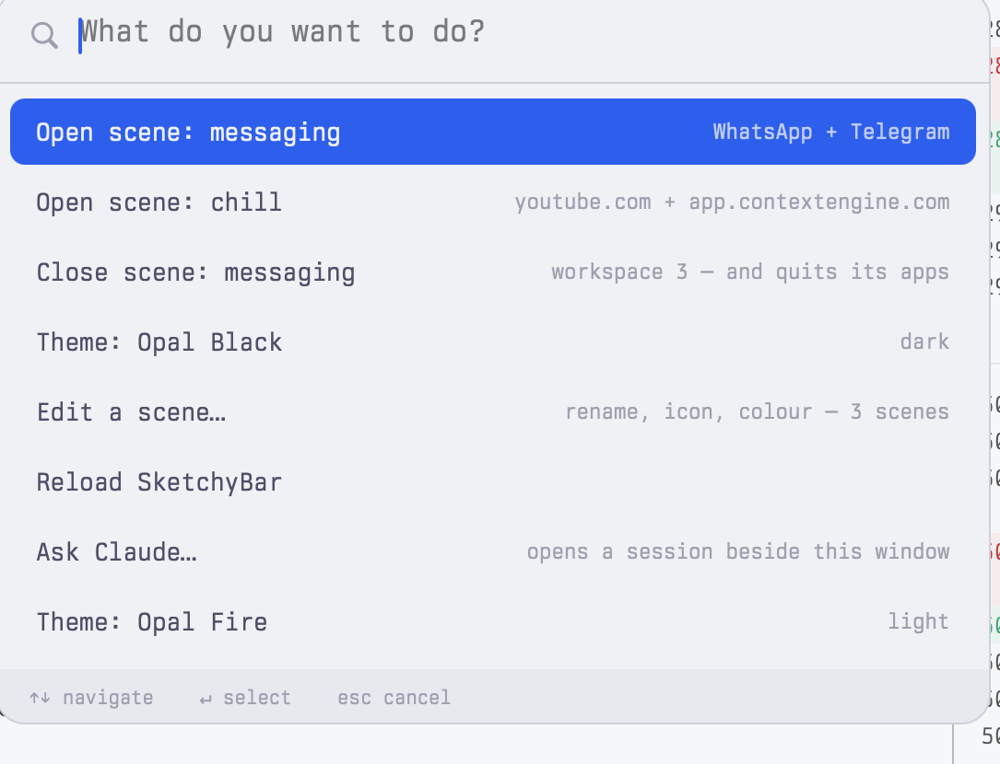
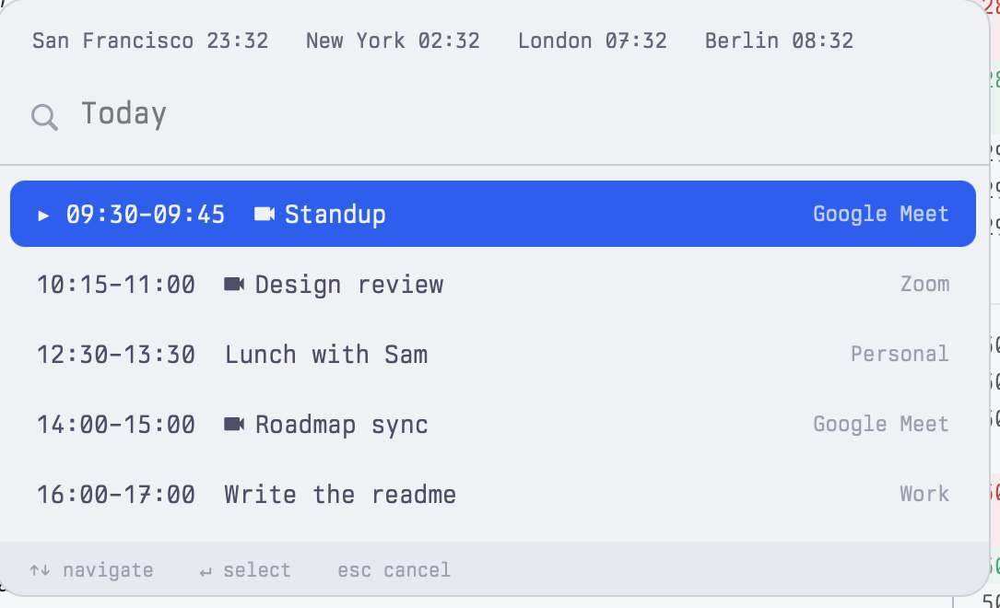

# dotfiles

A macOS desk that tiles itself, tells you what is next, and is driven end to end
by a single command: `dot`.

[AeroSpace](https://nikitabobko.github.io/AeroSpace/) does the tiling,
[SketchyBar](https://felixkratz.github.io/SketchyBar/) draws the bar,
[Ghostty](https://ghostty.org/) is the terminal, and a small Swift picker is the
only interface any of it needs. Themed **Opal** — pale surfaces, colour kept for
the things that carry meaning, and edges drawn rather than shadows cast.


Left to right: workspace pills, drawn only when occupied; the front app; then
volume, battery, and one chip carrying the date, the time and the next thing on
your calendar.

MIT licensed. New here? [docs/personas.md](docs/personas.md) describes who this
suits, and where it still asks too much.

## One command

`⌥space` — everything this setup can do, filtered as you type.



The palette is not a list somebody maintains. Every capability is one file in
`libexec/dot/` that answers `--describe` with JSON, and that descriptor **is**
the registration: the palette renders from it, `dot help` lists from it,
`dot capabilities --json` hands the whole surface to an agent. Add a file and it
is in the menu. Delete the file and it is gone. There is nowhere else to update.

```json
{
  "id": "scene.close",
  "summary": "Close every window on a scene's workspace",
  "destructive": true,
  "guard": "refuses any workspace the scene script did not open; --force overrides",
  "verify": "dot scene list --json",
  "instances": [{"label": "Close scene: chill", "detail": "workspace 3", "args": ["3"]}]
}
```

This repo once had a hand-written palette *and* a checker whose job was catching
drift between it and reality. Both are gone, and 33 capabilities have shipped
since without either coming back.

```sh
dot                        # what can I do?
dot menu --dry-run         # exactly what the palette will show, right now
dot capabilities --json    # the whole surface, machine-readable
```

## What this repo believes

Each of these cost something to learn. The long version, with the bugs still
attached, is [docs/principles.md](docs/principles.md).

**Verify against the world, not the exit code.** AeroSpace returns 0 and does
nothing, routinely. A font string that does not resolve falls back silently and
looks correct. Several bugs here survived precisely *because* something reported
success — so `dot doctor` asks the live system what it can see rather than
trusting what it was told.

**Destructive actions need a ledger, not a prompt.** `dot scene close` reads a
record of what that scene opened and refuses to touch anything else. A
confirmation dialog is too easy to click through, and focus drifts on its own,
so "act on the focused thing" will eventually act on the wrong thing. It already
did once.

**Data over code.** Scenes are `scenes.json`. Themes are a directory. Shortcuts
are read out of `aerospace.toml` and never written down a second time. Adding
any of them should not mean editing a script — and anything written down twice
goes wrong the first time you change one copy. The key table that used to live
in this readme was wrong twice before `dot keys` replaced it.

**Everything is a search path.** Capabilities, themes, bar widgets, scene
handlers and the world-clock list each look in `~/.config/dot/` before the copy
shipped here. You extend *or override* this setup without editing a tracked
file, which means you can keep pulling without ever merging.

**Latency is a feature.** The palette has to feel like part of the window
manager rather than like a program starting, so how long it takes is a thing
that gets measured. Getting the descriptor sweep under 230ms meant replacing an
AppleScript call with a state file, caching the scene merge, and collapsing
fifteen `jq` invocations into one — and measuring again later is what caught a
watchdog that had quietly been charging every open the full three-second
timeout it was meant to impose.

**Contrast is measured, not chosen.** Every colour a theme puts text on is
checked at 4.5:1 by a pre-commit hook. That hook exists because the
hand-checked palette turned out to be shipping a focused workspace pill at
4.34:1.

**Outlines, not shadows.** Nothing here floats above anything else. The bar, the
chips, the window borders and screenshots all draw their edge instead.

**A doc is part of the change it describes.** Stale documentation is worse than
none, because it is confidently wrong. Changing how something behaves without
updating the file that explains it is an incomplete change.

## Install on a new Mac

```sh
git clone https://github.com/merthurturk/Dotfiles.git ~/.dotfiles
~/.dotfiles/install.sh
```

`install.sh` installs Homebrew and the `Brewfile`, symlinks every config,
compiles the Swift picker, starts the services, and then prints the GUI-only
steps that remain — the permissions macOS will not grant from a script. It is
re-runnable, and anything it would overwrite is moved to
`~/.dotfiles-backup/<timestamp>/` first.

```sh
dot doctor    # is everything actually working, including the GUI-only steps?
```

Two things are worth knowing up front. **Berkeley Mono** is commercial and
cannot ship here: install it from your
[Berkeley Graphics](https://berkeleygraphics.com/) account, or everything falls
back to Hack Nerd Font until you do. All *text* is Berkeley Mono — terminal, bar
labels, picker — and Hack is used only for icon glyphs, which Berkeley Mono does
not carry. There are two traps in how its weights install; see
[docs/bar.md](docs/bar.md#fonts).

## Scenes

A scene is a named window layout opened onto a fresh workspace.

```sh
dot scene open chill      dot scene list
dot scene save work       dot scene restore
dot scene last            dot scene move 5
dot scene edit            dot scene close 3
dot window geometry       # where windows actually are
```

`dot scene save` is how you make one: arrange a workspace by hand, name it, and
it writes the spec — apps by name, Chrome windows with their tabs, in the order
they sit on screen. `dot scene edit` renames it and changes its icon, colour and
split, guided from the launcher. `dot scene last` bounces between the two you
are using, `dot scene move` takes one to another workspace windows and all, and
`dot scene restore` puts back whatever was open before a reboot.

| Scene | Windows |
|---|---|
| `chill` | YouTube / X / Instagram at 70%, Context Engine chat at 30% |
| `messaging` | WhatsApp and Telegram, 50/50 |

Definitions are **data**, in `config/aerospace/scenes.json` — adding one needs no
code and it reaches the palette immediately. A workspace running a scene shows
the scene's badge instead of app icons.

Window specs, the close ledger, and why windows are moved by id rather than by
switching workspace: [docs/scenes.md](docs/scenes.md).

## Date, time and what is next

The clock chip carries all three, and its icon says how soon — a clock when
nothing is ahead, a calendar going amber then green as it arrives.

Click it, or press `⌥⇧space` then `a`, and today opens in the picker: world
clocks in the header, whatever is running right now marked `▸` so the current
row is findable at a glance, and every event with a call marked `󰕧` so choosing
it asks which Chrome profile and joins.



```sh
dot calendar agenda           # today, as text
dot calendar agenda --json
```

Events come from EventKit, so **add Google under *System Settings → Internet
Accounts*** and they appear with no OAuth flow and no secret in this repo. A
resident helper owns the Calendars permission and publishes what is next into
the state directory; the bar and the launcher only ever read files. Edit the
cities in `config/aerospace/world-clocks.tsv`.

## The leader key

`⌥⇧space`, then one letter.

| | |
|---|---|
| `s` | scenes |
| `w` | windows |
| `t` | themes |
| `a` | today's agenda |
| `k` | every shortcut |
| `space` | the whole palette |

Thirty-odd capabilities do not fit on thirty-odd chords. One chord plus a
mnemonic letter is a smaller thing to remember than a dozen unrelated
combinations — and every capability added from here gets a key for free, because
the letters open the **launcher filtered** rather than naming commands. The bar
shows `DOT` while the mode is active, and it is always exactly one action long.

For the full map:

```sh
dot keys              # grouped, with what each one does
dot keys --json
```

It is rendered out of `aerospace.toml` every time, and what each key *does*
comes from the same capability descriptor the launcher reads — so `⌥⇧space s`
and the palette describe "Open scene: chill" identically, because it is one
string.

When something does earn a dedicated chord, it asks for one in its own
descriptor and `dot keys --apply` writes it into a block `aerospace.toml` ships
empty. For a scene that is one field:

```sh
dot scene edit chill --key ctrl-alt-c
```

The config stays the only source of truth for what is bound — it just stopped
being the only thing allowed to know about it. Before this, a chord was the one
thing a capability could not declare for itself, and the last place in the repo
where adding something meant editing a second file by hand.

## Pinned apps

`dot window pin` says "this app lives here" while you are looking at the window
that made you think it, which is the only moment you ever remember to.

```sh
dot window pin S          # Slack opens on workspace S from now on
dot window pin --list
dot window pin --off
```

It writes an AeroSpace `on-window-detected` rule into a marked block in
`aerospace.toml`, matched on bundle id, and moves the window you are looking at
to match. The block stays ordinary TOML you can edit by hand; `dot` reads it back
rather than keeping a second copy. Before installing a rewrite it checks that
everything outside the block is byte-identical, then that AeroSpace can still
parse the result, and rolls back if not.

## Themes

```sh
dot theme list
dot theme set opal-fire
```

Five of them — **Opal White**, **Opal Fire** and **Rosé Pine Dawn** light,
**Opal Black** and **Synthwave** dark. Switching takes the whole desk with it:
the bar, the window outlines, the wallpaper and screen saver, macOS's own
light/dark setting, and the terminal. Ghostty has no IPC on macOS, so open panes
are repainted **immediately** with OSC escape sequences written to their ttys
rather than waiting for a config reload.

A theme is a directory under `themes/` holding `colors.sh`, `ghostty.conf` and
`meta.json`. The bar's palette and the terminal's theme are symlinks into the
active one, so they cannot drift apart. Making a sixth takes one command:

```sh
dot theme new "Midnight Ice" --from opal-black --accent '#7c3aed'
```

It writes to `~/.config/dot/themes/`, so your theme needs no commit here. The
accent is not copied in, it is *fitted* — darkened, or lightened under dark
text, until the workspace pill's label clears 4.5:1 on it — and then the new
theme is graded on the spot with the same checker the pre-commit hook runs.
Contrast is measured, not chosen, and that has to include the colours you pick
five minutes from now. The desktop picture is rendered from the
theme's own `colors.sh` at your display's pixel size, which is why there is no
image in this repo:

```sh
dot theme wallpaper            # re-render for the current theme
dot theme wallpaper --show     # what macOS actually has set
dot theme wallpaper --restore  # back to what you had before
```

Accents are darkened from their upstream palettes until text on them clears
4.5:1. Why that is necessary, and how the wallpaper store is edited safely:
[docs/themes.md](docs/themes.md).

## Extending it without forking it

Five search paths, each preferring `~/.config/dot/` over the shipped copy:

```
~/.config/dot/libexec/<group>-<verb>     a capability -- appears in dot help,
                                         the palette, and `dot <group> <verb>`
~/.config/dot/themes/<name>/             a theme
~/.config/dot/sketchybar/items/55-x.sh   a bar widget
~/.config/dot/spec-handlers/<kind>       a scene window-spec verb
~/.config/dot/world-clocks.tsv           your cities
```

Earlier wins, so the same mechanism **overrides** a shipped one: drop your own
`window-split` in and it shadows this repo's without touching a tracked file.
Nothing needs registering — a capability is discovered by its `--describe`, a
widget by its filename.

```sh
cat > ~/.config/dot/libexec/hello-world <<'EOF'
#!/usr/bin/env bash
source "${DOT_LIB:?}"
[ "$1" = --describe ] && { jq -n '{id:"hello.world",summary:"Mine",args:[],
  destructive:false,instances:[{label:"Say hello",detail:"",args:[]}]}'; exit; }
echo hello
EOF
chmod +x ~/.config/dot/libexec/hello-world
dot hello world        # and it is in ⌥space
```

Removing one is the same move backwards: delete the file and reload. A bar
reload is a *rebuild* — every item is torn down and re-added — precisely so that
"drop in a file" and "delete the file" are symmetric.

## The bar

Workspace pills are drawn only when occupied or focused, with per-app glyphs;
a scene's workspace shows the scene's badge instead. On the right sit
now-playing, volume, battery and the clock. Clicking now-playing focuses Music's
window *through AeroSpace*, so it switches to the right workspace rather than
raising a window where it is.

Clickable items take a blue ring on hover. Only the border changes, never the
fill, so it reads correctly over every state colour — and SketchyBar has no
cursor property, so the ring is the whole affordance available.

Updates arrive over a launchd agent, `config/aerospace/event-bridge.sh`, which
subscribes to AeroSpace's event stream and turns it into SketchyBar triggers,
replacing about forty per-binding `--trigger` calls. AeroSpace emits nothing when
a window *closes*, so a watcher also polls every 5s as a backstop.

Items, geometry, fonts and colour: [docs/bar.md](docs/bar.md).

## The picker

`config/aerospace/src/picker.swift` compiles to one standalone chooser —
auto-focused search, fuzzy filter, arrows, enter — and everything in this setup
that asks you something uses it. It is generic: lines on stdin, the choice on
stdout.

```sh
ls ~/Projects | PICKER_PROMPT="Open project" ~/.config/aerospace/bin/picker
```

Detail columns, text-input mode, the alternate `⇧↵` action and frecency:
[docs/picker.md](docs/picker.md).

## Asking in plain language

```sh
dot ai "why isn't my focus chip toggling?"
```

Opens a real Claude Code session in a Ghostty window **beside** the focused one,
in this repo, with your request as the opening message. It gets the full toolkit:
it can read the configs, run `dot`, check what actually happened and iterate —
which a one-shot planner cannot. `dot capabilities --json` is the manifest it
reads: every command, its arguments, whether it is destructive and how it is
guarded.

## Documentation

| Doc | For |
|---|---|
| [personas](docs/personas.md) | who this is for, and where it still falls short |
| [principles](docs/principles.md) | the rules above, and what each one cost |
| [architecture](docs/architecture.md) | how the parts fit together, and which process writes which state file |
| [capabilities](docs/capabilities.md) | the `dot` surface, descriptors, adding one |
| [bar](docs/bar.md) | SketchyBar items, geometry, fonts |
| [scenes](docs/scenes.md) · [themes](docs/themes.md) · [picker](docs/picker.md) | the pieces |
| [macos](docs/macos.md) | platform constraints worth knowing |
| [troubleshooting](docs/troubleshooting.md) | symptom → cause |
| [backlog](docs/backlog.md) | what's next, ordered by daily impact |

`CLAUDE.md` and `.claude/skills/dot/` carry the same contract for AI sessions.

## Layout

| Path | Links to |
|---|---|
| `aerospace.toml` | `~/.aerospace.toml` |
| `config/aerospace/` | `~/.config/aerospace/` |
| `config/sketchybar/` | `~/.config/sketchybar/` |
| `config/ghostty/` | `~/.config/ghostty/` |

Anything added under `config/` is linked to `~/.config/<name>` automatically —
no edit to `install.sh` needed.

To update the package list, prefer editing `Brewfile` by hand: the checked-in
one groups entries by purpose, and `brew bundle dump` is unsorted and
uncommented.

## Development

```sh
dot doctor                   # the live system, including the GUI-only steps
bin/check-capabilities.sh    # every capability describes itself correctly
bin/check-themes.sh          # every theme's text clears 4.5:1
dot menu --dry-run           # print the palette without a GUI
```

`githooks/pre-commit` runs shell syntax, shellcheck and both checks above;
`install.sh` points `core.hooksPath` at it.

## Uninstalling

```sh
./uninstall.sh          # say what would happen
./uninstall.sh --yes    # do it
```

Removes the symlinks, stops the services, unloads the agents and restores the
one global macOS setting `install.sh` changed. Your backups in
`~/.dotfiles-backup/` are left alone — restoring them automatically could
overwrite something you have since changed. Permissions have to be revoked in
System Settings; nothing can do that for you.

## Notes worth keeping

The things that cost real time here — TCC and which process a permission
actually attaches to, bash 3.2's missing associative arrays, squircle corners,
notch insets, invisible characters in app names, macOS's window shadow being
readable but not writable without disabling SIP — are recorded in
[docs/macos.md](docs/macos.md) rather than repeated here, so there is one copy
to keep true.
